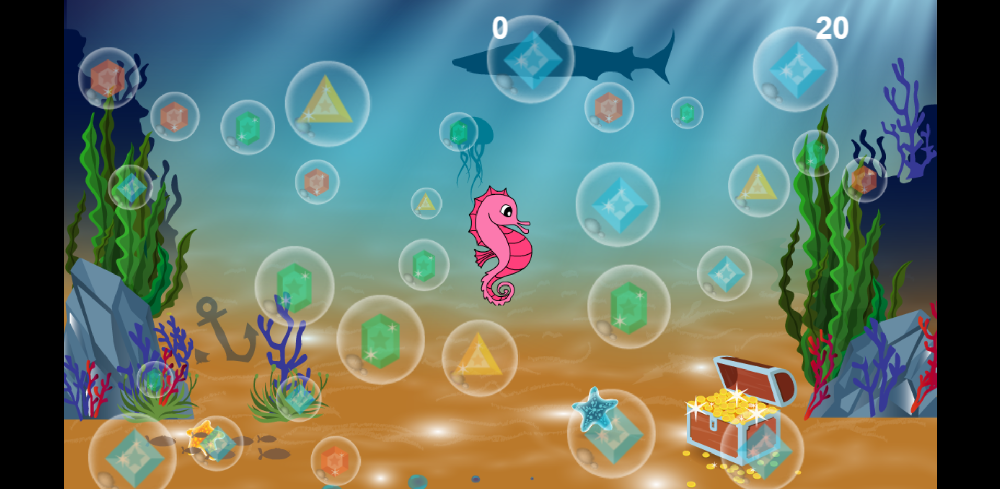

# Creacion de Juegos 2D con Phaser
El repositorio es del juego atlantis, el cual fue desarrollado utilizando HTML, CSS y JS. Además de Phaser que es un framework para la creación de juegos 2D.
## Reglas
El juego es muy sencillo para ganar se deben de explotar todos los diamantes antes de que el cronometro se detenga con el caballito de mar, el caballito de mar se mueve conforme al mouse. Cada diamante suma 100 puntos más al marcador, si se termina el tiempo antes de termina se termina el juego.
En esta versión 1 del juego se deve reiniciar la página para poder jugar de nuevo.
Los diamantes siempre aparecen en un lugar diferente.
## Interfaz

## Link del juego
[ATLANTIS](https://carlos123che.github.io/JuegosWeb_Phaser/ "atlantis game")
## Link del curso

[Curso](https://www.udemy.com/course/programacion-de-juegos-web-2d-en-javascript-html5-con-phaser/learn/lecture/8745180?start=0#overview"atlantis game")